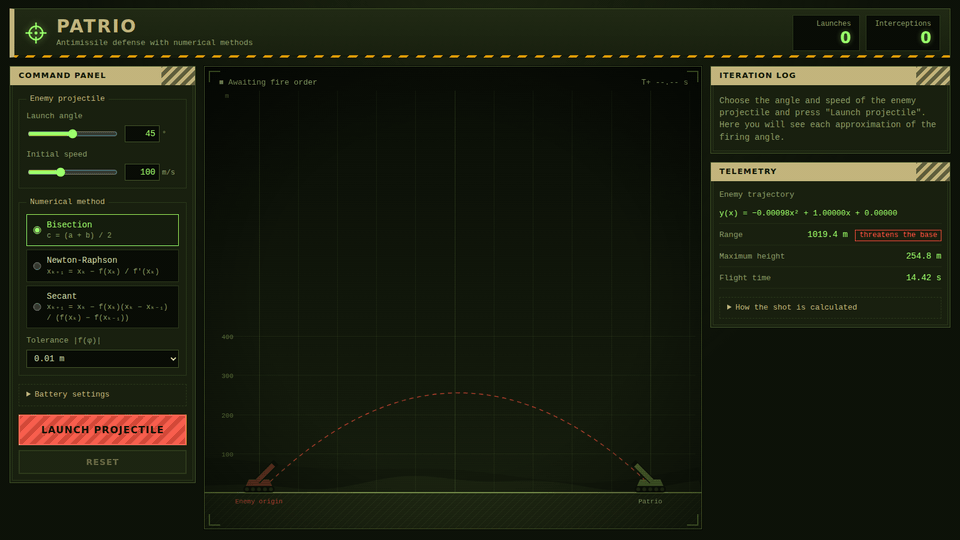
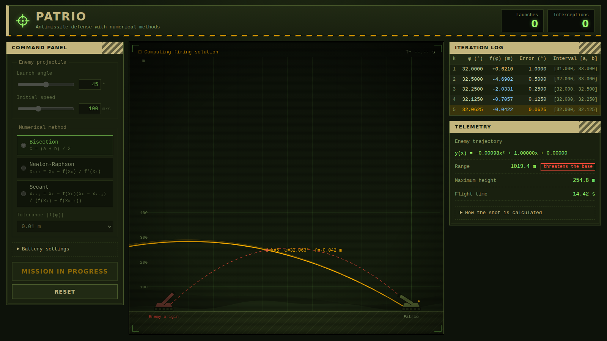
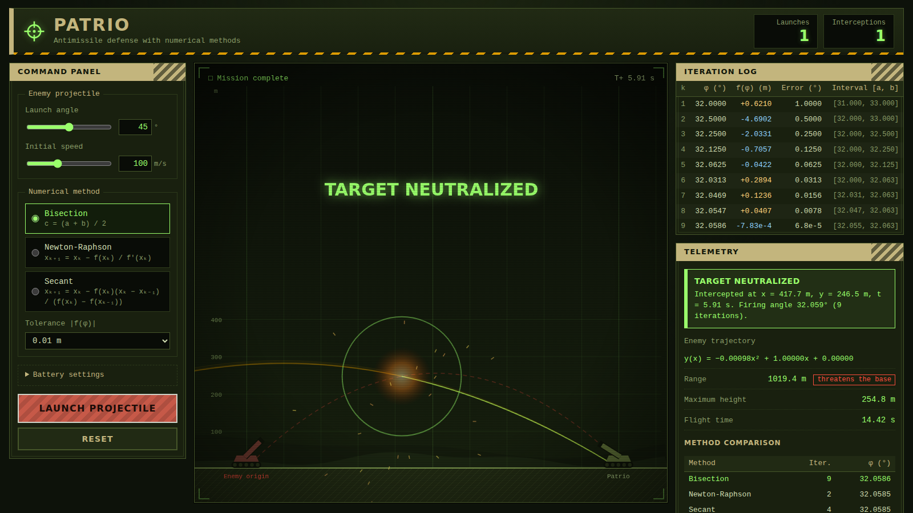
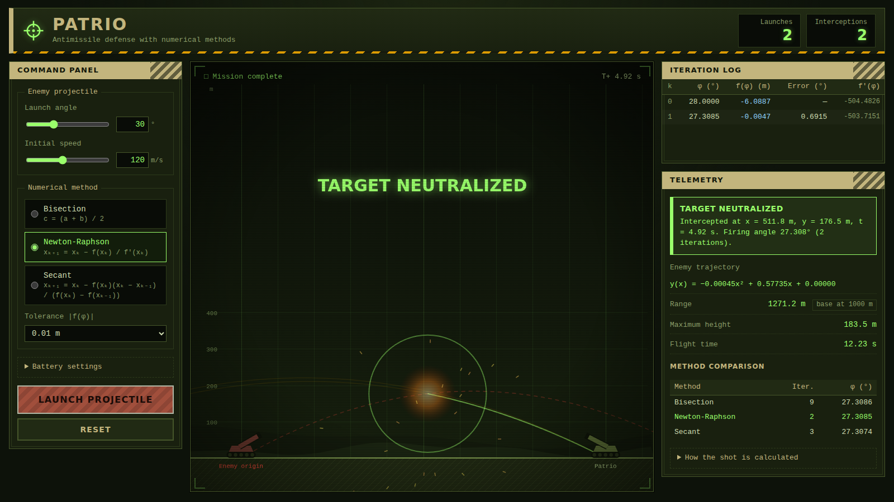
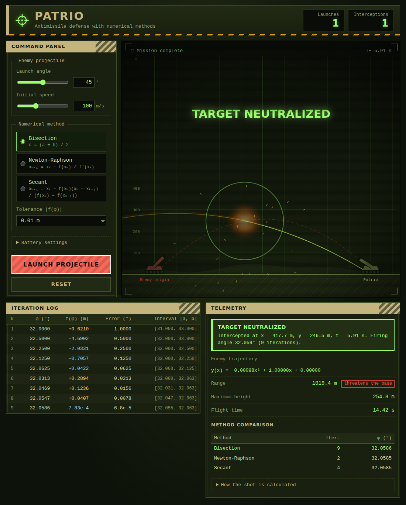
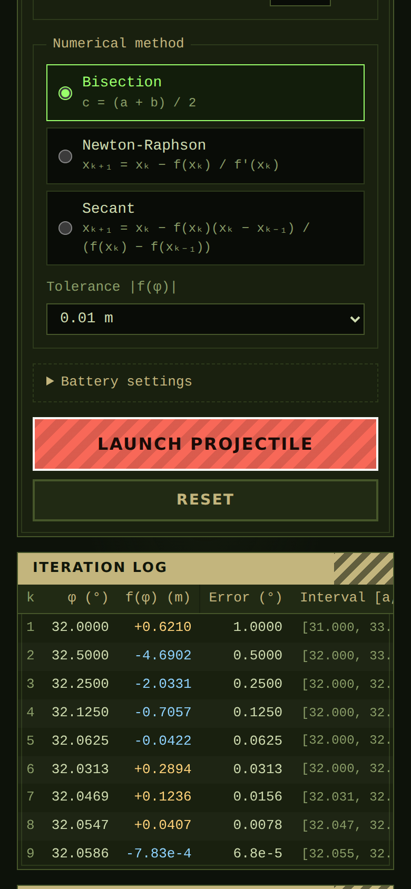

<div align="center">

# 🎯 Patrio

### Missile-defense game powered by numerical methods

A browser game where you fire a projectile and a battery computes, **iteration 
by iteration and on screen**, the exact angle needed to shoot it down, using 
**Bisection**, **Newton-Raphson** or the **Secant method**.


<br />



</div>

---

## Table of contents

- [About the project](#about-the-project)
- [Features](#features)
- [Screenshots](#screenshots)
- [How it works](#how-it-works)
  - [1. Projectile motion is a degree-2 polynomial](#1-projectile-motion-is-a-degree-2-polynomial)
  - [2. Turning an interception into one equation](#2-turning-an-interception-into-one-equation)
  - [3. The three numerical methods](#3-the-three-numerical-methods)
  - [4. Finding the starting interval](#4-finding-the-starting-interval)
- [Results](#results)
- [Getting started](#getting-started)
- [How to play](#how-to-play)
- [Project structure](#project-structure)
- [Design decisions](#design-decisions)
- [Limitations and roadmap](#limitations-and-roadmap)
- [Deployment](#deployment)
- [License](#license)
- [Author](#author)

---

## About the project

**Patrio** is a game built for a university **Numerical Methods** course. The assignment:

> The user sets the **angle** and the **speed** to launch a projectile. 
The system must use any of the methods seen in class to **intercept** the projectile, 
and must **show graphically the approximation** until it shoots it down. 
The projectile always follows parabolic motion, i.e. a 2D polynomial function of degree 2.

The twist that makes it interesting: the battery does not "know" the answer. 
It has to **search** for it. Every iteration of the chosen root-finding method 
becomes an arc on the tactical map, so you can literally watch the numerical method converge.

| Requirement | How Patrio covers it |
| --- | --- |
| The user enters angle and speed | Slider + numeric input for each value (5°–85°, 20–250 m/s) |
| Use a numerical method to intercept | Bisection, Newton-Raphson **and** Secant, selectable at any time |
| Show the approximation graphically | One firing arc per iteration, the vertical miss distance, and a live iteration table |
| Parabolic motion, degree-2 polynomial | Each trajectory is $y(x) = a_2x^2 + a_1x + a_0$, displayed in the telemetry panel |
| Military look and feel | Tactical-map canvas, stencil typography, hazard stripes, phosphor-green HUD |

## Features

- 🧮 **Three root-finding methods** implemented from scratch (no math libraries), with the same stopping criterion so they can be compared fairly.
- 📈 **Convergence you can see**: each iteration draws the candidate firing arc and the gap `f(φ)` between both projectiles at the moment they cross.
- 🧾 **Live iteration table** with the angle, `f(φ)`, estimated error and method-specific data (interval, derivative or previous iterate).
- 📊 **Method comparison** after every shot: iterations and final angle for all three methods on the *same* launch.
- 🎛️ **Configurable tolerance** from 1 m down to 0.0001 m, plus interceptor speed, firing delay and animation speed.
- 🛡️ **Honest failure handling**: if no interception exists, or Newton/Secant diverge, the game says so instead of hiding it.
- 🖥️ **Responsive layout** that adapts from phones to wide monitors (see [Design decisions](#design-decisions)).
- ⚡ **Smooth canvas animation** at display refresh rate with no per-frame React re-renders.

## Screenshots

<table>
  <tr>
    <td width="50%">
      
      <p align="center">
        <b>Searching</b>
        <br/>
        Bisection refines the angle; each arc is one iteration (here, k = 5).
      </p>
    </td>
    <td width="50%">
      
      <p 
        align="center">
        <b>Target neutralized</b>
        <br/>
        Interception at the predicted point, plus the method comparison (9 / 2 / 4 iterations).
      </p>
    </td>
  </tr>
  <tr>
    <td width="50%">
      
      <p align="center">
        <b>Newton-Raphson</b>
        <br/>
        Converges in just 2 iterations on this launch.
      </p>
    </td>
    <td width="50%">
      
      <p align="center">
        <b>Laptop layout</b>
        <br/>
        Controls and map on top, log and telemetry below.
      </p>
    </td>
  </tr>
</table>

<p align="center">
  
  <br />
  <b>Phone layout</b>
</p>

---

## How it works

### 1. Projectile motion is a degree-2 polynomial

Ignoring air resistance, a projectile launched from $(x_0, y_0)$ with speed $v$ 
at angle $\alpha$ moves as

$$
x(\tau) = x_0 + d\,v\cos\alpha\,\tau
\qquad
y(\tau) = y_0 + v\sin\alpha\,\tau - \tfrac{1}{2}g\tau^2
$$

where $\tau$ is the time since launch, $g = 9.81\ \text{m/s}^2$ and $d = +1$ 
(flying right) or $-1$ (flying left). Eliminating $\tau$ gives the trajectory as 
a **polynomial of degree 2** in $x$:

$$
y(x) = y_0 + d\tan\alpha\,(x - x_0) - \frac{g}{2v^2\cos^2\alpha}\,(x - x_0)^2
$$

### 2. Turning an interception into one equation

The scenario has two projectiles:

- The **enemy projectile** leaves $x = 0$ at $t = 0$ with the speed $v_e$ and angle $\theta$ chosen by the player.
- The **Patrio battery** sits at $x = D$ (1000 m) and fires to the left at $t = t_d$ (detection and computation delay) with a fixed speed $v_i$ and an **unknown angle $\varphi$**.

Shooting the target down means being at the **same point at the same time**: two conditions (x and y) with two unknowns ($\varphi$ and the instant of impact). Matching the horizontal positions removes the time unknown:

$$
v_e\cos\theta\; t = D - v_i\cos\varphi\,(t - t_d)
\;\Longrightarrow\;
\tau(\varphi) = \frac{D - v_e\cos\theta\; t_d}{v_e\cos\theta + v_i\cos\varphi}
\qquad t(\varphi) = t_d + \tau(\varphi)
$$

For any candidate angle, both projectiles are therefore at the same $x$ at $t(\varphi)$. 
What is left is the **vertical gap** between them at that instant:

$$
f(\varphi) = y_{\text{enemy}}\big(t(\varphi)\big) - y_{\text{interceptor}}\big(t(\varphi)\big)
$$

**Finding the firing angle means solving $f(\varphi) = 0$.** The dashed red 
vertical line drawn on each iteration is exactly $|f(\varphi)|$, and watching 
it shrink to zero is the convergence of the method.

### 3. The three numerical methods

All three live in [`src/numerical/methods.ts`](src/numerical/methods.ts). 
They know nothing about projectiles: they receive a function and look for its root.

| Method | Iteration | Starting data | Strengths | Weaknesses |
| --- | --- | --- | --- | --- |
| **Bisection** | $c = \dfrac{a+b}{2}$, keep the half where $f$ changes sign | Interval $[a, b]$ with $f(a)f(b) \le 0$ | Always converges once bracketed | Slowest (linear convergence) |
| **Newton-Raphson** | $x_{k+1} = x_k - \dfrac{f(x_k)}{f'(x_k)}$ | One point: the midpoint of the interval | Very fast (quadratic) | Needs $f'$; can diverge |
| **Secant** | $x_{k+1} = x_k - \dfrac{f(x_k)(x_k - x_{k-1})}{f(x_k) - f(x_{k-1})}$ | Two points: the interval endpoints | Fast, no derivative needed | Can diverge or stall |

Shared details:

- **Stopping criterion:** $|f(\varphi)| < \text{tolerance}$ (a distance in metres, selectable in the UI), with a maximum of 60 iterations.
- **Derivative in Newton:** central difference $f'(x) \approx \dfrac{f(x+h) - f(x-h)}{2h}$ with $h = 10^{-6}$ rad, so the method works on any $f$ without symbolic differentiation.
- **Safety checks:** Newton and Secant report failure when the derivative (or secant slope) vanishes, or when the next angle leaves the allowed range of 1°–89°.
- **Error column:** half the interval width for Bisection, and $|x_k - x_{k-1}|$ for the open methods.

### 4. Finding the starting interval

Bisection needs a sign change and the other methods need sensible starting points, 
so [`findBracket`](src/numerical/interception.ts) first **scans** $\varphi$ 
from 1° to 89° in 2° steps looking for a sign change of $f$. Among the intervals 
found it keeps only **physically valid** ones (the crossing must happen in the 
air and after the shot) and picks the one that intercepts **earliest**. 
If no interval exists, the game reports that the target cannot be intercepted.

---

## Results

Each row is one launch with the default battery (interceptor at 140 m/s, 1 s 
delay) and a tolerance of 0.01 m. Counts are the iterations each method needed.

| Enemy launch | Interval found | Bisection | Newton-Raphson | Secant | Firing angle $\varphi^*$ |
| --- | --- | :---: | :---: | :---: | :---: |
| 45° at 100 m/s | 31°–33° | 9 | 2 | 4 | 32.059° |
| 30° at 120 m/s | 27°–29° | 9 | 2 | 3 | 27.31° |
| 60° at 90 m/s | 35°–37° | 10 | 3 | 3 | 35.021° |
| 20° at 150 m/s | 23°–25° | 6 | 2 | 3 | 23.594° |
| 80° at 100 m/s | 45°–47° | 11 | 3 | 4 | 45.401° |
| 10° at 200 m/s | 15°–17° | 8 | 2 | 3 | 15.43° |
| 45° at 40 m/s | none | – | – | – | Not interceptable: it lands 163 m from its origin |

The expected ranking shows up clearly: **Newton-Raphson < Secant < Bisection** 
in iterations, while Bisection is the only one that is guaranteed to converge 
once the root is bracketed.

As a robustness check, 2,000 random launches (angle 20°–75°, speed 80–180 m/s) 
were solved with all three methods: about 91% had an interception solution, 
and **all three methods converged on every one of those**.

---

## Getting started

### Prerequisites

- [Node.js](https://nodejs.org/) 20 or newer
- npm (bundled with Node.js)

### Installation

```bash
# 1. Clone the repository
git clone https://github.com/Cristianco9/patrio-interceptor-game.git
cd patrio-interceptor-game

# 2. Install dependencies
npm install

# 3. Start the development server
npm run dev
```

Open the address printed in the terminal (usually <http://localhost:5173>).

### Available scripts

| Command | What it does |
| --- | --- |
| `npm run dev` | Starts the Vite dev server with hot reload |
| `npm run build` | Type-checks the project and creates a production build in `dist/` |
| `npm run preview` | Serves the production build locally |

---

## How to play

1. **Set the threat.** In the *Command panel* choose the launch **angle** (5°–85°) and **initial speed** (20–250 m/s). The predicted trajectory appears as a dashed red parabola, and the telemetry panel shows its polynomial, range, apex and flight time. A *threatens the base* tag appears when the projectile would land near the battery.
2. **Pick a method.** Bisection, Newton-Raphson or Secant, and the tolerance for $|f(\varphi)|$.
3. **Fire.** Press **Launch projectile**. The game goes through these phases:
   1. *Calculating firing solution*: one amber arc per iteration, the vertical gap `f(φ)` and a new row in the iteration table.
   2. *Solution locked*: a reticle marks the predicted interception point.
   3. *Projectiles in flight*: both projectiles fly and meet at that point.
   4. *Target neutralized*: explosion, outcome message and the comparison of the three methods.
4. **Experiment.** Try the same launch with each method, tighten the tolerance, or change the interceptor speed and firing delay under *Battery settings*. Try slow projectiles (they may be impossible to intercept) and watch how Newton and Secant fail differently from Bisection.

---

## Design decisions

- **One function, three solvers.** The solvers only see `f(φ)`. Adding a fourth method (regula falsi, Brent…) means writing one function and registering it.
- **Every method runs on every shot.** `buildMission` solves the same launch with all three methods up front; the UI animates the selected one and uses the others for the comparison table.
- **Animation outside React state.** The canvas timeline (current iteration, simulated time, explosion) lives in `useRef` and is driven by `requestAnimationFrame`. React is notified only when something visible to the rest of the UI changes, so there are no 60 fps re-renders.
- **A pure rendering function.** `drawScene(ctx, w, h, frame)` receives a snapshot and draws it, with no hidden state. The same snapshot always produces the same image.
- **Physical validity checks.** A root of $f$ is accepted only if the crossing happens above ground and after the shot, so a mathematically valid but impossible solution is rejected.
- **Responsive layout.**

  | Viewport | Layout |
  | --- | --- |
  | Wider than 1280 px | Controls, map and log/telemetry in three columns; the map stays in view while the side panels scroll |
  | 861–1280 px (laptops) | Controls and map side by side; log and telemetry always **below** the map |
  | 860 px or less | Single column with the map first |

---

## Limitations and roadmap

**Current simplifications**

- No air resistance or wind; flat ground and both launchers at ground level.
- The battery position (1000 m) is fixed.
- When several valid interceptions exist, only the earliest is solved.
- Newton-Raphson and Secant can diverge by design; the game reports this rather than hiding it.

**Ideas for the future**

- [ ] Unit tests for the solvers and `f(φ)` (Vitest)
- [ ] Configurable battery distance and launch height
- [ ] Air drag with an ODE integrator (RK4) and numerical root finding on the simulated path
- [ ] More methods: false position, Brent, fixed point
- [ ] Convergence plot of $|f(\varphi_k)|$ against the iteration number
- [ ] Multiple simultaneous projectiles and a scoring system
- [ ] Language switch (the interface is now fully in English; a Spanish translation could return as an option)

---

## Deployment

The production build is a static site, so it works on any static host.

- **Vercel / Netlify:** import the repository; the defaults (`npm run build`, output `dist`) work as they are.
- **GitHub Pages:** set the base path in `vite.config.ts` to your repository name, build, and publish `dist/`:

  ```ts
  export default defineConfig({
    plugins: [react()],
    base: '/patrio/',
  });
  ```

---

## License

Released under the **MIT License**. See the `LICENSE` file for details.

## Author

**Cristian Camilo** — [@Cristianco9](https://github.com/Cristianco9)

Built as a Numerical Methods course project. If you use it to learn or teach, 
a ⭐ on the repository is always appreciated.
